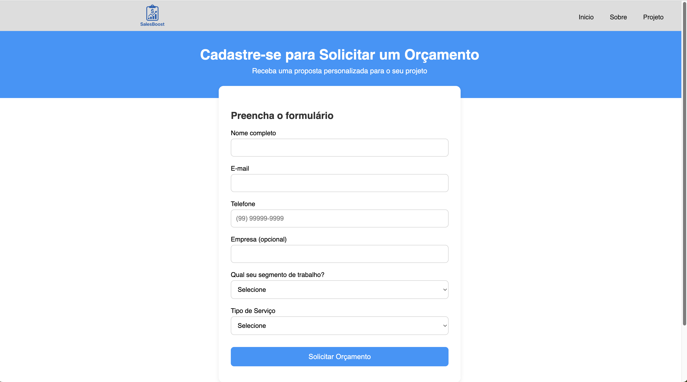

# Programação de Funcionalidades

Implementação da aplicação descritas por meio dos requisitos codificados.

[Utilize a estrutura abaixo para cada funcionalidade entregue na etapa]

### Aplicação responsiva

#### Requisito atendido

RF-01: A aplicação deverá ser responsiva permitindo a visualização em dispositivos diversos de forma adequada para todos os usuários

#### Artefatos da funcionalidade

- index.html
- style.css

#### Instruções de acesso

Acessar o path: /codigo-fonte/index.html

#### Responsável

Ronei Santos, Italo Willian e Lucas Costa

### Solicitar orçamento

#### Requisito atendido

RF-02: A aplicação deve permitir ao usuário gerar e consultar orçamentos.

#### Artefatos da funcionalidade

- cadastro.html
- cadastro.css
- cadastro.component.js

#### Instruções de acesso

Acessar o path: /codigo-fonte/pages/cadastro/cadastro.html

#### Responsável

Italo Willian
