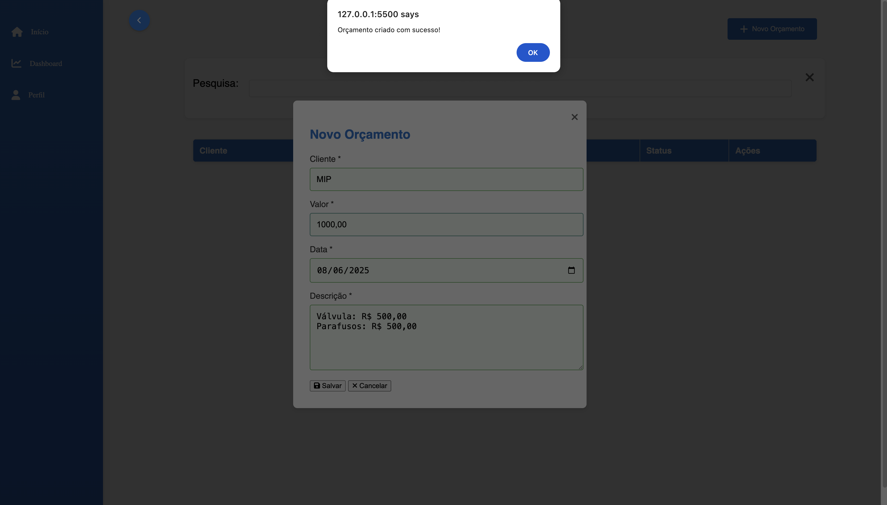
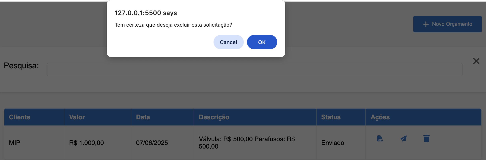
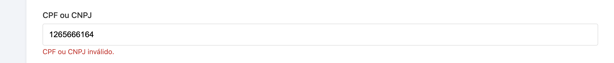
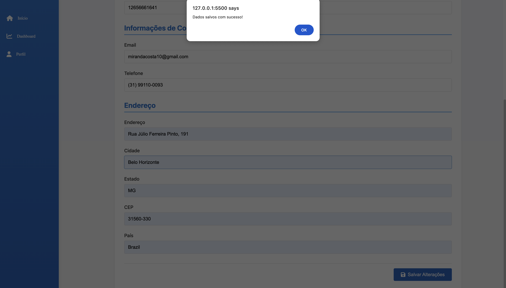

# Registro de Testes de Software

Relatório com as evidências dos testes de software realizados na aplicação pela equipe, baseado no plano de testes pré-definido.

| Caso de Teste                              | CT-01 -Criar Orçamento com Sucesso               |
| :----------------------------------------- | :----------------------------------------------- |
| Resultados obtidos                         | Sistema cadastrou corretamente um novo orçamento |
| Responsável pela execução do caso de Teste | Ronei Santos                                     |

| Caso de Teste                              | CT-02 - Deletar Orçamento com Sucesso    |
| :----------------------------------------- | :--------------------------------------- |
| Resultados obtidos                         | Sistema deletou corretamente o orçamento |
| Responsável pela execução do caso de Teste | Ronei Santos                             |

| Caso de Teste                              | CT-03 - Validar Campos Obrigatórios de Usuário |
| :----------------------------------------- | :--------------------------------------------- |
| Resultados obtidos                         | Sistema validou campos corretamente            |
| Responsável pela execução do caso de Teste | Ronei Santos                                   |

| Caso de Teste                              | CT-04 - Enviar Orçamento e Alterar Status |
| :----------------------------------------- | :---------------------------------------- |
| Resultados obtidos                         | O status foi alterado para enviado        |
| Responsável pela execução do caso de Teste | Ronei Santos                              |

| Caso de Teste                              | CT-05 - Cadastrar Usuário e Exibir Mensagem de Sucesso |
| :----------------------------------------- | :----------------------------------------------------- |
| Resultados obtidos                         | Os dados do usuário foram registrado com sucesso       |
| Responsável pela execução do caso de Teste | Ronei Santos                                           |

